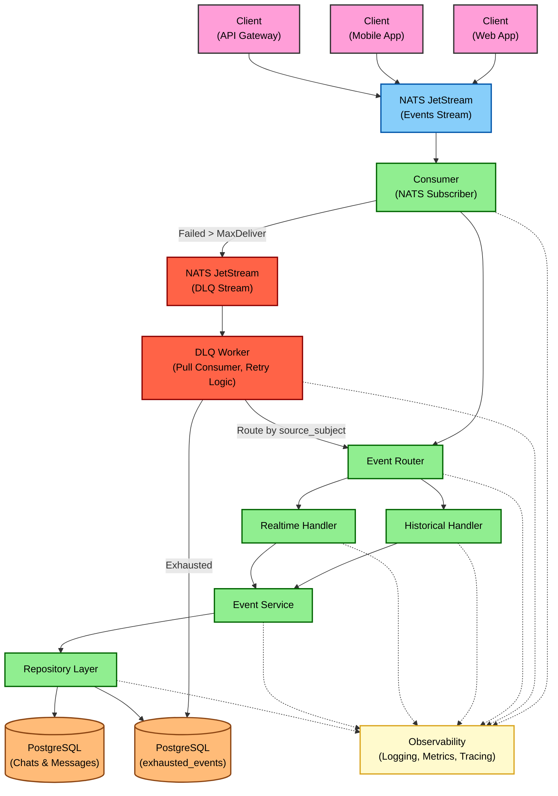

# System Architecture

This document provides a comprehensive overview of the Daisi WA Events Processor architecture, detailing how the system ingests, processes, and persists message events from various sources.

## 1. High-level Flow

The Daisi WA Events Processor follows a clean, event-driven architecture:

1. Events are produced by various clients and published to NATS JetStream
2. The service consumes these events from NATS
3. Events are parsed, validated against JSON schemas, and routed to appropriate handlers
4. Events are processed by domain-specific business logic
5. Processed data is persisted to appropriate databases (PostgreSQL)
6. Events are acknowledged to ensure reliable processing

This architecture enables:
- Loose coupling between producers and consumers
- Fault tolerance through retry mechanisms
- Multi-tenant data isolation
- Reliable, persistent event storage
- Scalability through distributed processing

## 2. Architecture Diagram

## 3. Core Components

### 3.1 Event Listener (NATS Subscriber)

The NATS JetStream consumer is responsible for:

- Establishing connections to NATS servers
- Creating and configuring streams and consumers if they don't exist
- Subscribing to event subjects with proper durability
- Extracting message metadata and tenant information
- Handling message acknowledgment (ACK/NACK)
- Implementing retry logic for failed messages
- Recovering from panics in message handlers

**Implementation:**
- `internal/ingestion/jetstream.go` - Contains the `Consumer` struct that implements the subscriber
- `internal/jetstream/client.go` - Provides the client interface for JetStream interactions

### 3.2 Schema Validator

All incoming event payloads are validated against predefined schemas to ensure:

- Required fields are present
- Field types are correct
- Data format meets business rules

**Implementation:**
- Uses `go-playground/validator` with struct tags
- Schema definitions in `internal/model/payload.go`
- Validation in handlers before processing

### 3.3 Event Router

The router directs messages to appropriate handlers based on event type:

- Routes historical events to `HistoricalHandler`
- Routes realtime events to `RealtimeHandler`
- Supports versioned event types (e.g., `v1.messages.upsert`)
- Handles unknown event types with default handler

**Implementation:**
- `internal/ingestion/router.go` - Contains the `Router` struct
- `EventHandler` function type for processing callbacks

### 3.4 Handlers

Two main handler types process different event categories:

**Historical Handler:**
- Processes bulk historical data imports
- Handles `v1.history.chats`, `v1.history.messages`, `v1.history.contacts`
- Implemented in `internal/ingestion/handler/historical.go`

**Realtime Handler:**
- Processes individual real-time events
- Handles create/update operations on chats, messages, and contacts
- Implemented in `internal/ingestion/handler/realtime.go`

### 3.5 Service Layer

The service layer contains core business logic:

- Validates semantic business rules
- Transforms event payloads to database models
- Coordinates with repository layer for persistence
- Handles tenant-specific processing

**Implementation:**
- `internal/usecase/service.go` - Main service structure
- `internal/usecase/chat_service.go` - Chat-specific business logic
- `internal/usecase/message_service.go` - Message-specific business logic
- `internal/usecase/processor.go` - Orchestrates all components

### 3.6 Repository Layer

Manages PostgreSQL interactions for chats, messages, contacts, agents, and exhausted events.

Handles multi-tenant database operations (schema per tenant).

Manages table creation for new tenants if `postgresAutoMigrate` is enabled.

**Implementation:**
- `internal/storage/postgres.go` - PostgreSQL repository implementation.
- `internal/storage/adapters.go` - Adapters implementing specific repository interfaces (ChatRepo, MessageRepo, etc.) using the PostgresRepo.
- `internal/storage/repository.go` - Interface definitions for each data type (ChatRepo, MessageRepo, ContactRepo, AgentRepo, OnboardingLogRepo, ExhaustedEventRepo).

### 3.7 Observability Components

Comprehensive monitoring and debugging tools:

- **Logging:** Contextual structured logging with `zap`
- **Metrics:** Prometheus metrics for event counts and processing duration
- **Tracing:** OpenTelemetry integration (planned)

**Implementation:**
- `internal/observer/metrics.go` - Prometheus metrics
- `pkg/logger/logger.go` - Logging setup and utilities

## 4. Message Processing

### 4.1 Message Flow Detail

1. Message arrives from NATS JetStream
2. Consumer extracts metadata and tenant information
3. Message is routed to appropriate handler
4. Handler unmarshals and validates the payload
5. Handler calls service methods for business logic
6. Service transforms data and calls repository methods
7. Repository persists data to appropriate database
8. Success/failure is returned up the chain
9. Consumer acknowledges or rejects the message
10. Metrics and logs are generated throughout the process

### 4.2 Processing Strategies

#### Batching Strategy

The service implements batching for historical data imports:

- Bulk imports handled via `v1.history.*` event types
- Single transaction for all items in a batch
- Repository layer implements efficient bulk upsert operations
- Optimistic locking with "upsert" semantics in database

#### Acknowledgment Strategy

Explicit, manual acknowledgment is used:

- Each message requires explicit ACK after successful processing.
- Messages encountering errors are NACKed for retry by JetStream up to `max_deliver` attempts.
- Messages exceeding `max_deliver` attempts or facing non-retryable errors are published to the DLQ (see below)
- Acknowledgment timeout configured per consumer (e.g., 30s or 60s)

#### Retry Strategy

A multi-level retry approach is employed:

1. **JetStream Retry:** NACKed messages are automatically redelivered by JetStream up to `max_deliver` times
2. **Database Retry:** Critical operations implement retry with exponential backoff
3. **Idempotent Operations:** All handlers are designed to be idempotent for safe retries
4. **DLQ Worker Retry:** Messages sent to the DLQ are processed by a separate worker (`internal/dlqworker`) which implements its own retry logic with exponential backoff (up to 5 attempts, 1m base delay, 15m max delay)

#### Dead-Letter Queue (DLQ) Handling

A formal Dead-Letter Queue (DLQ) mechanism handles persistently failing messages:

- **DLQ Subject:** Messages failing initial JetStream retries (`max_deliver`) are published to `v1.dlq.<company_id>`
- **DLQ Worker:** A dedicated Go worker subscribes to the DLQ stream
- **Retry & Backoff:** The worker attempts reprocessing with exponential backoff
- **Persistence:** Messages failing all worker retries are stored in the `exhausted_events` PostgreSQL table for manual analysis
- **Monitoring:** Specific Prometheus metrics track the DLQ process

## 5. Multi-tenancy

The system is fully multi-tenant:

- **NATS Isolation:** Consumer names and queue groups include the company ID for logical separation.
- **Context Propagation:** The company ID is carried through the request context.
- **Database Isolation:** Achieved via schema-per-tenant (e.g., `daisi_<company_id>`) or table prefixing automatically handled by the persistence layer based on the company ID in the context.
- **Logging:** Logs are tagged with the company ID.

## 6. Onboarding Logic

The service includes application-level logic (`internal/usecase/message_service.go::createOnboardingLogIfNeeded`) to support automatic contact creation. When an incoming message (`flow=IN`) is processed, the system checks if a contact exists for the sender's phone number within the company. If not, an entry is created in the `onboarding_log` table, potentially triggering downstream processes or database triggers to create the actual contact record.

## 7. Security & Resilience

### 7.1 Security Features

- No sensitive data in logs or error messages
- Company isolation in database models
- Context-aware authorization

### 7.2 Resilience Features

- Graceful shutdown handling
- Connection retry logic for NATS and potentially database operations.
- Panic recovery middleware
- Comprehensive error logging
- Health check endpoints

## 8. Future Enhancements

- Formal DLQ implementation for poison message handling
- OpenTelemetry tracing implementation
- Enhanced database sharding for scaling
- Command-Query Responsibility Segregation (CQRS) pattern
- More extensive metrics and alerting

## 9. Deployment Considerations & Sizing

The following recommendations are based on initial benchmark tests (Go's `testing -bench`) run on an Apple M2 Pro (ARM64) with mocked repository layers. These provide a baseline understanding but **must be validated with comprehensive load testing in a production-like environment.**

### 9.1 Interpretation of Benchmark Results

The benchmarks indicate:

-   **Realtime Event Processing:** Individual realtime event handlers (e.g., `ChatUpsert`, `MessageUpdate`) are generally efficient.
    -   Typical operation time: ~20-30 microseconds (µs).
    -   Memory allocation per operation: ~15-22 Kilobytes (KB).
    -   Allocations per operation: ~130-190.
    -   The `AgentEvent` handler appears to be the most lightweight among realtime operations.

-   **Historical Batch Processing:** Performance scales with batch size.
    -   `count=1`: Similar to realtime operations.
    -   `count=10`: Roughly 3-4 times slower than `count=1`. For example, `HistoricalHandler_Chats` for `count=10` took ~82µs.
    -   `count=100`: Shows a more significant increase in processing time and memory.
        -   `HistoricalHandler_Chats` (count=100): ~637µs, ~653KB allocated.
        -   `HistoricalHandler_Messages` (count=100): ~927µs, ~1.16MB allocated.
    -   This suggests that while bulk operations are efficient at the database level (mocked here), the application-level processing, data transformation, and iteration for larger batches contribute to increased resource usage.

#### 9.1.1 Raw Benchmark Output (Apple M2 Pro, ARM64)

| Benchmark Name                                | Time/Op (ns) | Memory/Op (B) | Allocs/Op |
| :-------------------------------------------- | -----------: | ------------: | --------: |
| BenchmarkHistoricalHandler_Chats/count=1      | 27289        | 17519         | 188       |
| BenchmarkHistoricalHandler_Chats/count=10     | 81969        | 50772         | 643       |
| BenchmarkHistoricalHandler_Chats/count=100    | 636831       | 652873        | 5167      |
| BenchmarkHistoricalHandler_Messages/count=1   | 42859        | 22088         | 225       |
| BenchmarkHistoricalHandler_Messages/count=10  | 133922       | 92666         | 964       |
| BenchmarkHistoricalHandler_Messages/count=100 | 927149       | 1164707       | 8235      |
| BenchmarkHistoricalHandler_Contacts/count=1   | 28717        | 17557         | 181       |
| BenchmarkHistoricalHandler_Contacts/count=10  | 88266        | 53289         | 572       |
| BenchmarkHistoricalHandler_Contacts/count=100 | 696130       | 671693        | 4466      |
| BenchmarkRealtimeHandler_ChatUpsert           | 22429        | 15729         | 148       |
| BenchmarkRealtimeHandler_ChatUpdate           | 30247        | 21387         | 183       |
| BenchmarkRealtimeHandler_MessageUpsert        | 26351        | 20131         | 180       |
| BenchmarkRealtimeHandler_MessageUpdate        | 30337        | 21600         | 186       |
| BenchmarkRealtimeHandler_ContactUpsert        | 23289        | 15607         | 138       |
| BenchmarkRealtimeHandler_ContactUpdate        | 31557        | 21869         | 191       |
| BenchmarkRealtimeHandler_AgentEvent           | 19576        | 14547         | 128       |

### 9.2 Key Observations for Sizing

-   The service is relatively lightweight for processing individual, discrete realtime events.
-   Historical batch ingestion is more resource-intensive, particularly concerning CPU time (for iterating and processing each item in the batch) and memory (for holding the unmarshalled batch data).

### 9.3 Initial Sizing Recommendations (Per Pod/Container)

These are starting points and should be adjusted based on actual load testing:

-   **CPU:**
    -   **Baseline:** Start with **1 vCPU**. This should be adequate for moderate realtime event throughput.
    -   **Higher Load / Batch Processing:** Consider **2-4 vCPUs** if:
        -   The service will handle very high volumes of realtime events concurrently.
        -   Frequent or very large historical batch imports are expected. The Go runtime can utilize multiple cores for goroutines spawned during processing.

-   **Memory:**
    -   **Baseline:** Start with **256MB - 512MB RAM**. This should suffice for environments primarily handling realtime events, given the ~15-22KB per-op allocation.
    -   **Higher Load / Batch Processing:** Increase to **1GB - 2GB RAM** if:
        -   Large historical batches (e.g., hundreds or thousands of items per batch) are a common workload. The benchmarks showed ~1.16MB allocated for a batch of 100 historical messages; larger payloads or batch sizes will require more.
        -   High concurrency of realtime events leads to many concurrent allocations.

-   **Replicas (Pods):**
    -   **Baseline:** Start with **2-3 replicas** for high availability and to distribute moderate realtime load.
    -   **Scaling Strategy:**
        -   Utilize a Horizontal Pod Autoscaler (HPA) in Kubernetes.
        -   Configure HPA based on CPU and memory utilization.
        -   If NATS JetStream queue metrics (like queue depth or processing latency) can be exposed to Kubernetes (e.g., via a custom metrics adapter or Prometheus), consider using these for more sophisticated autoscaling, especially for historical/batch workloads.
        -   For very spiky historical import loads, consider if a separate, dedicated pool of workers/pods (scaled differently) for historical streams might be beneficial, though this adds complexity.

### 9.4 Important Caveats

-   **Microbenchmark Limitations:** The provided results are from microbenchmarks with mocked external dependencies (database, NATS). Real-world performance will be influenced by the actual performance of these systems.
-   **Environment Differences:** Performance on typical x86-64 cloud instances (e.g., AWS EC2, GKE nodes) may differ from the ARM64-based Apple M2 Pro.
-   **Network Latency:** Latency between the service pods, NATS, and PostgreSQL will significantly impact overall event processing time.
-   **Payload Variability:** Actual event payload sizes and complexity will affect processing time and memory.
-   **Garbage Collection (GC):** Under sustained high load, especially with high allocation rates seen in batch processing, Go's GC will have an impact. This was not deeply analyzed in these benchmarks.
-   **Concurrency:** The benchmarks measure individual operation performance. Concurrent request handling in a deployed environment will introduce additional complexities (e.g., contention, context switching).

### 9.5 Recommended Next Steps for Production Sizing

1.  **Comprehensive Load Testing:** Execute realistic load tests in a staging or production-like environment. Use tools like the project's `cmd/tester` or other industry-standard load testing tools (k6, JMeter, etc.).
2.  **Monitor Key Metrics:** During load tests, closely monitor:
    -   Pod CPU and Memory utilization.
    -   Go runtime metrics (e.g., GC pause times, goroutine count).
    -   NATS JetStream metrics (e.g., queue depth, message processing rates, ACK latencies).
    -   PostgreSQL performance (e.g., query latencies, connection counts, CPU/IO utilization).
    -   Application-specific metrics (event processing latency, error rates).
3.  **Profiling:** If bottlenecks are identified, use Go's profiling tools (`pprof`) to understand CPU and memory hotspots under load.
4.  **Iterative Adjustment:** Based on load testing results and monitoring, iteratively adjust CPU/memory requests and limits, and replica counts for your Kubernetes deployments. Balance performance with cost considerations.