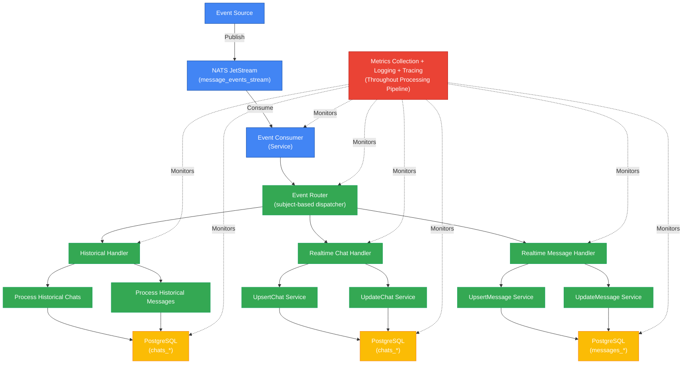

# Event Consumer

## Overview

The Daisi WA Events Processor is built on an event-driven architecture that consumes messages from NATS JetStream. It processes various types of events related to chats, messages, and contacts (both realtime updates and historical data imports).

- The service automatically sets up required streams and consumers in NATS
- All events are validated against JSON schemas before processing
- Multi-tenant support with tenant ID context propagation
- Observability with structured logging, metrics, and tracing

## Consumer Configuration (NATS Stream & Consumer)

### Stream Configuration

```yaml
stream:
  name: message_events_stream
  subjects: 
    - v1.history.chats
    - v1.history.messages
    - v1.history.contacts
    - v1.connection.update
    - v1.chats.update
    - v1.messages.update
    - v1.contacts.update
    - v1.chats.upsert
    - v1.messages.upsert
    - v1.contacts.upsert
  storage: FILE    # Persistent storage
  retention: LIMITS  # Based on configured limits
  max_age: 720h # Default 30 days (configurable via nats.<consumer>.max_age)
  replicas: 1        # Number of replicas
```

### Consumer Configuration

*Note: The `max_deliver` value determines how many times JetStream attempts redelivery before a message is sent to the DLQ. The defaults are configurable via `nats.realtime.maxDeliver` (default: 5) and `nats.historical.maxDeliver` (default: 3).*

```yaml
consumer:
  durable_name: <consumer_name>_<company_id> # e.g., wa_listener_CompanyAAA01 (Config: nats.<type>.consumer + company_id)
  ack_policy: EXPLICIT             # Manual acknowledgment
  deliver_subject: _INBOX.<random> # Ephemeral inbox for push delivery (handled by nats.go client)
  deliver_group: <queue_group>_<company_id> # e.g., wa_event_group_CompanyAAA01 (Config: nats.<type>.group + company_id)
  max_deliver: 5 # Default for realtime (Config: nats.realtime.maxDeliver), 3 for historical (Config: nats.historical.maxDeliver)
  # ack_wait and max_ack_pending for regular consumers are not explicitly defined
  # in the service config and may rely on NATS client defaults or internal settings.
  # DLQ consumer specific settings are configured via nats.dlqAckWait and nats.dlqMaxAckPending.
  ack_wait: 30s # Example: Default NATS client or hardcoded value (Verify implementation)
  max_ack_pending: 1000 # Example: Default NATS client or hardcoded value (Verify implementation)
```

## Subscribed Subjects

The service subscribes to subjects dynamically based on the `subject_list` configured in `internal/config/default.yaml` (under `nats.realtime` and `nats.historical`) and the specific `company_id` the service instance is running for.

The pattern is: `<base_subject_from_config>.<company_id>`.

For a service instance running with `company_id = "tenant_dev"`, it would listen on the following subjects:

### v1.history.chats
- **Description**: Batch import of historical chat data
- **Handler**: `histHandler.HandleEvent` (routes to `ProcessHistoricalChats`)
- **Base Subject**: `v1.history.chats`
- **Example Subject Listened**: `v1.history.chats.tenant_dev`
- **Message Schema**: `UpsertChatPayload` (within `HistoryChatPayload` wrapper, see `docs/schema.md`)
- **Sample Payload**: (See `docs/schema.md` HistoryChatPayload)
```json
{
  "chats": [
    {
      "chat_id": "uuid:historical-chat-001",
      "jid": "6281234567890@s.whatsapp.net",
      "company_id": "tenant_dev",
      "phone_number": "6281234567890",
      "agent_id": "agent_import_1",
      "is_group": false,
      "unread_count": 0,
      "conversation_timestamp": 1714567700
    },
    {
      "chat_id": "uuid:historical-chat-002",
      "jid": "group-123@g.us",
      "company_id": "tenant_dev",
      "phone_number": "",
      "agent_id": "agent_import_1",
      "push_name": "Support Group",
      "group_name": "Support Group",
      "is_group": true,
      "conversation_timestamp": 1714567800
    }
  ]
}
```

### v1.history.messages
- **Description**: Batch import of historical message data
- **Handler**: `histHandler.HandleEvent` (routes to `ProcessHistoricalMessages`)
- **Base Subject**: `v1.history.messages`
- **Example Subject Listened**: `v1.history.messages.tenant_dev`
- **Message Schema**: `UpsertMessagePayload` (within `HistoryMessagePayload` wrapper, see `docs/schema.md`)
- **Sample Payload**: (See `docs/schema.md` HistoryMessagePayload)
```json
{
  "messages": [
    {
      "message_id": "uuid:historical-msg-001",
      "chat_id": "uuid:chat-123",
      "jid": "6281234567890@s.whatsapp.net",
      "flow": "IN",
      "company_id": "tenant_dev",
      "agent_id": "agent_import_1",
      "message_obj": {
        "conversation": "First historical message"
      },
      "status": "read",
      "message_timestamp": 1714567700
    },
    {
      "message_id": "uuid:historical-msg-002",
      "chat_id": "uuid:chat-123",
      "jid": "6281234567890@s.whatsapp.net",
      "flow": "OUT",
      "company_id": "tenant_dev",
      "agent_id": "agent_import_1",
      "message_obj": {
        "image": {
          "url": "https://example.com/image.jpg",
          "caption": "Second historical message (image)"
        }
      },
      "status": "sent",
      "message_timestamp": 1714567800
    }
  ]
}
```

### v1.history.contacts
- **Description**: Batch import of historical contact data
- **Handler**: `histHandler.HandleEvent` (routes to `ProcessHistoricalContacts`)
- **Base Subject**: `v1.history.contacts`
- **Example Subject Listened**: `v1.history.contacts.tenant_dev`
- **Message Schema**: `UpsertContactPayload` (within `HistoryContactPayload` wrapper, see `docs/schema.md`)
- **Sample Payload**: (See `docs/schema.md` HistoryContactPayload)

### v1.chats.upsert
- **Description**: Create or update a single chat
- **Handler**: `realtimeHandler.HandleEvent` (routes to `UpsertChat`)
- **Base Subject**: `v1.chats.upsert`
- **Example Subject Listened**: `v1.chats.upsert.tenant_dev`
- **Message Schema**: `UpsertChatPayload` (see `docs/schema.md`)
- **Sample Payload**: (See `docs/schema.md` UpsertChatPayload)
```json
{
  "chat_id": "uuid:chat-test001",
  "jid": "6281234567890@s.whatsapp.net",
  "company_id": "tenant_dev",
  "agent_id": "agent_whatsapp_1",
  "phone_number": "6281234567890",
  "push_name": "Test Customer",
  "custom_name": "Test Chat",
  "group_name": "",
  "assigned_to": "agent_007",
  "conversation_timestamp": 1714567890,
  "unread_count": 2,
  "not_spam": true,
  "is_group": false,
  "last_message": {
    "id": "uuid:msg-last001",
    "content": "Latest message in the chat"
  }
}
```

### v1.chats.update
- **Description**: Update chat metadata (unread count and conversation timestamp)
- **Handler**: `realtimeHandler.HandleEvent` (routes to `UpdateChat`)
- **Base Subject**: `v1.chats.update`
- **Example Subject Listened**: `v1.chats.update.tenant_dev`
- **Message Schema**: `UpdateChatPayload` (see `docs/schema.md`)
- **Sample Payload**: (See `docs/schema.md` UpdateChatPayload)
```json
{
  "chat_id": "uuid:chat-test001",
  "company_id": "tenant_dev",
  "unread_count": 0,
  "conversation_timestamp": 1714568000
}
```

### v1.messages.upsert
- **Description**: Create or update a single message
- **Handler**: `realtimeHandler.HandleEvent` (routes to `UpsertMessage`)
- **Base Subject**: `v1.messages.upsert`
- **Example Subject Listened**: `v1.messages.upsert.tenant_dev`
- **Message Schema**: `UpsertMessagePayload` (see `docs/schema.md`)
- **Sample Payload**: (See `docs/schema.md` UpsertMessagePayload)
```json
{
  "message_id": "uuid:message-test001",
  "to": "user_y",
  "from": "user_x",
  "chat_id": "uuid:chat-123",
  "jid": "6281234567890@s.whatsapp.net",
  "flow": "IN",
  "company_id": "tenant_dev",
  "agent_id": "agent_whatsapp_1",
  "key": {
    "id": "uuid:key-test001",
    "from_me": false,
    "remote_jid": "6281234567890@s.whatsapp.net"
  },
  "message_obj": {
    "conversation": "Hello, this is a test message"
  },
  "status": "sent",
  "message_timestamp": 1714567800
}
```

### v1.messages.update
- **Description**: Update status of an existing message
- **Handler**: `realtimeHandler.HandleEvent` (routes to `UpdateMessage`)
- **Base Subject**: `v1.messages.update`
- **Example Subject Listened**: `v1.messages.update.tenant_dev`
- **Message Schema**: `UpdateMessagePayload` (see `docs/schema.md`)
- **Sample Payload**: (See `docs/schema.md` UpdateMessagePayload)
```json
{
  "chat_id": "uuid:message-test001",
  "company_id": "tenant_dev",
  "status": "delivered"
}
```

### v1.contacts.upsert
- **Description**: Create or update a single contact
- **Handler**: `realtimeHandler.HandleEvent` (routes to `UpsertContact`)
- **Base Subject**: `v1.contacts.upsert`
- **Example Subject Listened**: `v1.contacts.upsert.tenant_dev`
- **Message Schema**: `UpsertContactPayload` (see `docs/schema.md`)
- **Sample Payload**: (See `docs/schema.md` UpsertContactPayload)

### v1.contacts.update
- **Description**: Update specific fields of an existing contact
- **Handler**: `realtimeHandler.HandleEvent` (routes to `UpdateContact`)
- **Base Subject**: `v1.contacts.update`
- **Example Subject Listened**: `v1.contacts.update.tenant_dev`
- **Message Schema**: `UpdateContactPayload` (see `docs/schema.md`)
- **Sample Payload**: (See `docs/schema.md` UpdateContactPayload)

### v1.connection.update
- **Description**: Upsert agent status information (e.g., connection status, QR code)
- **Handler**: `realtimeHandler.HandleEvent` (routes to `UpsertAgent`)
- **Base Subject**: `v1.connection.update`
- **Example Subject Listened**: `v1.connection.update.tenant_dev`
- **Message Schema**: `UpsertAgentPayload` (see `docs/schema.md`)
- **Sample Payload**: (See `docs/schema.md` UpsertAgentPayload)

## Acknowledgement Behavior

The service uses explicit acknowledgment to ensure reliable message processing:

1. **Manual Acknowledgment**: Each message requires explicit acknowledgment after successful processing.
2. **Error Handling**:
   - Validation errors: Message is NACKed (negative acknowledgment) and typically sent to the DLQ immediately as they are usually not retryable.
   - Processing errors: Message is NACKed for retry by JetStream up to `max_deliver` times.
   - Panic recovery: Message is NACKed and error is logged; JetStream will attempt redelivery.
3. **Retry Configuration**:
   - Maximum delivery attempts by JetStream: As configured per consumer (e.g., 3 or 5).
   - Acknowledgment wait time: As configured per consumer (e.g., 30s or 60s).
   - **DLQ Handling**: If a message fails processing after `max_deliver` attempts, it is published to the Dead-Letter Queue (DLQ) subject `v1.dlq.<company_id>`.
4. **Processing Guarantees**:
   - At-least-once delivery for initial processing attempts via JetStream.
   - Idempotent operations in handlers are crucial for safety with potential duplicate messages during retries.

## Retry & DLQ Handling

When messages fail processing repeatedly, they are handled by a dedicated Dead-Letter Queue (DLQ) system:

1. **DLQ Publishing**: Consumers publish persistently failing messages (those exceeding `max_deliver` attempts or encountering fatal errors) to the `v1.dlq.<company_id>` subject within the `dlq_stream`.
2. **DLQ Worker**: A separate background worker (`internal/dlqworker`) subscribes to the DLQ stream using a pull consumer.
3. **Retry Logic (Worker)**:
   - The worker attempts to re-process the message by routing it back through the appropriate handler based on its original subject (`source_subject` in the DLQ payload).
   - If processing fails again, the worker applies an **exponential backoff** strategy before re-enqueueing the message to the DLQ stream via NAK with delay.
   - **Worker Retry Policy**:
     - Base Delay: Configurable via `nats.dlqBaseDelayMinutes` (Env: `NATS_DLQBASEDELAYMINUTES`, Default: 5 minutes).
     - Max Delay: Configurable via `nats.dlqMaxDelayMinutes` (Env: `NATS_DLQMAXDELAYMINUTES`, Default: 5 minutes).
     - Max Retries by Worker: 5 attempts (Currently hardcoded as `maxRetries` in `internal/dlqworker/worker.go`).
   - **Consumer NAK Delays**: These delays are applied by the *initial* consumer *before* sending to the DLQ.
     - NAK Base Delay: Configurable per consumer type via `nats.<type>.nakBaseDelay` (Defaults: `1s` realtime, `2s` historical).
     - NAK Max Delay: Configurable per consumer type via `nats.<type>.nakMaxDelay` (Defaults: `30s` realtime, `60s` historical).
4. **Exhausted Messages**: If a message fails processing even after the worker's max retry attempts, it is considered "exhausted".
5. **Persistence**: Exhausted messages (along with their original payload and error details) are saved to the `exhausted_events` table in the PostgreSQL database for manual inspection and potential reprocessing.
6. **Monitoring**: The DLQ system exposes Prometheus metrics (e.g., `dlq_fetch_requests_total`, `dlq_tasks_dropped_total`) for monitoring its health and throughput. See `docs/operator-guide.md` for details.

## Message Processing Flow

1. Message arrives from NATS JetStream
2. Service extracts metadata and tenant information
3. Event router identifies appropriate handler based on subject
4. Message is validated against JSON schema
5. Business logic processes the event
6. Database operations are performed
7. Message is acknowledged (or NACKed if errors occur)
8. Metrics are updated and spans are completed

### Dataflow Diagram



## Notes

### Multi-Tenancy

- Each tenant has an isolated subscription with a unique consumer name
- Company ID is added as a prefix to the consumer and queue group names
- Company ID is propagated through the processing context
- Data is scoped to tenant ID for storage operations

### Versioning and Backward Compatibility

- Event types use version prefixes (e.g., `v1.messages.upsert`)
- The `EventType` struct includes utilities for version extraction and manipulation:
  - `GetVersion()`: Extracts version string
  - `GetBaseType()`: Returns type without version
  - `WithVersion()`: Applies a new version to a type
- New versions can be added while maintaining support for old versions
- Schema validation ensures clean versioning boundaries

### Observability

The service includes comprehensive observability features:

#### Metrics

- `events_received_total`: Counter of received events (labels: event_type, sender)
- `events_processed_total`: Counter of successfully processed events (labels: event_type, sender)
- `events_failed_total`: Counter of failed events (labels: event_type, sender)
- `processing_duration_seconds`: Histogram of processing times (labels: event_type, status)

#### Logging

- Context-aware structured logging with zap
- Company ID and request ID included in all logs
- Message metadata included in processing logs

#### Tracing (Plan)

- OpenTelemetry tracing for end-to-end visibility
- Spans for message reception, validation, and processing
- Error details attached to spans 